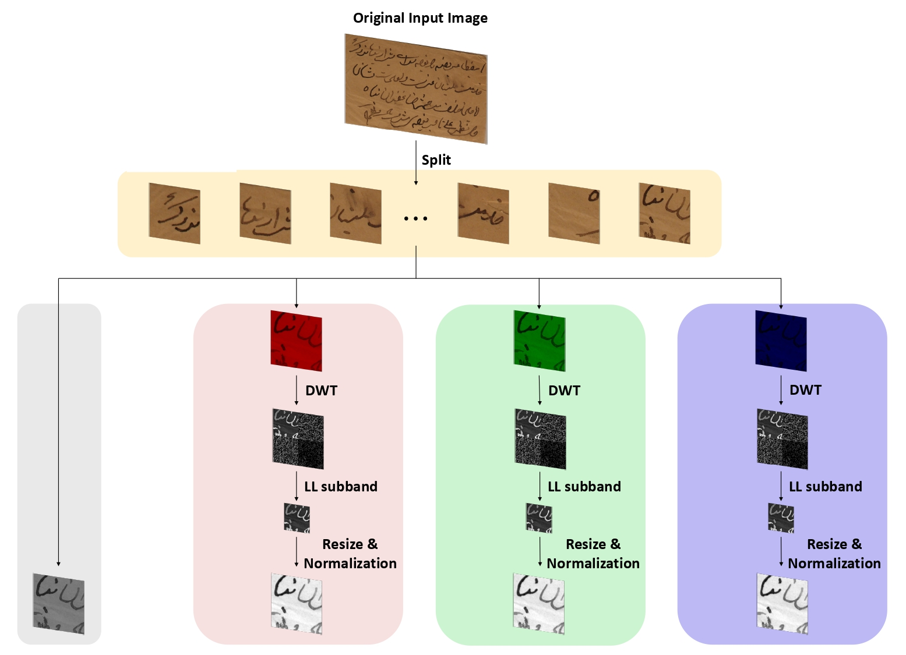
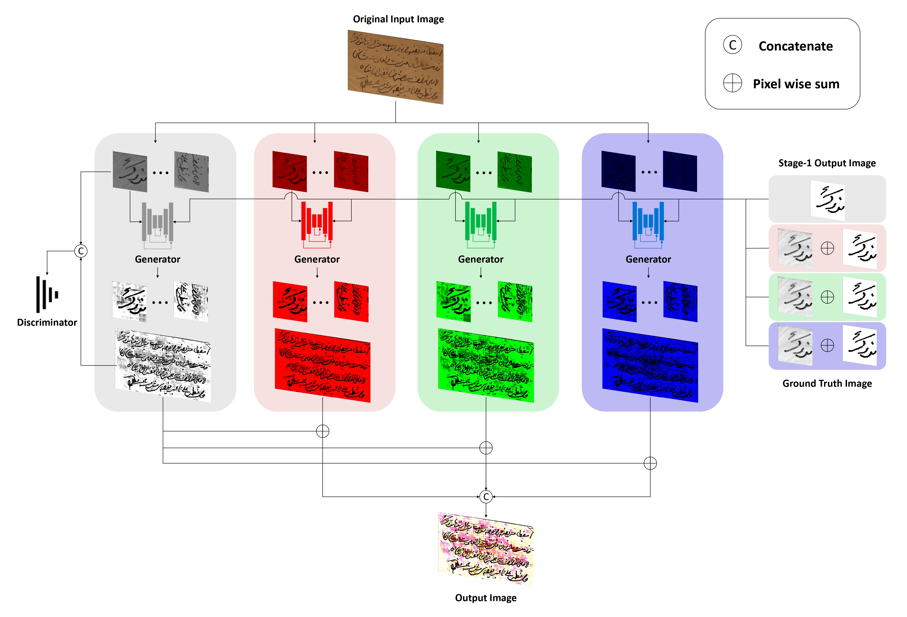
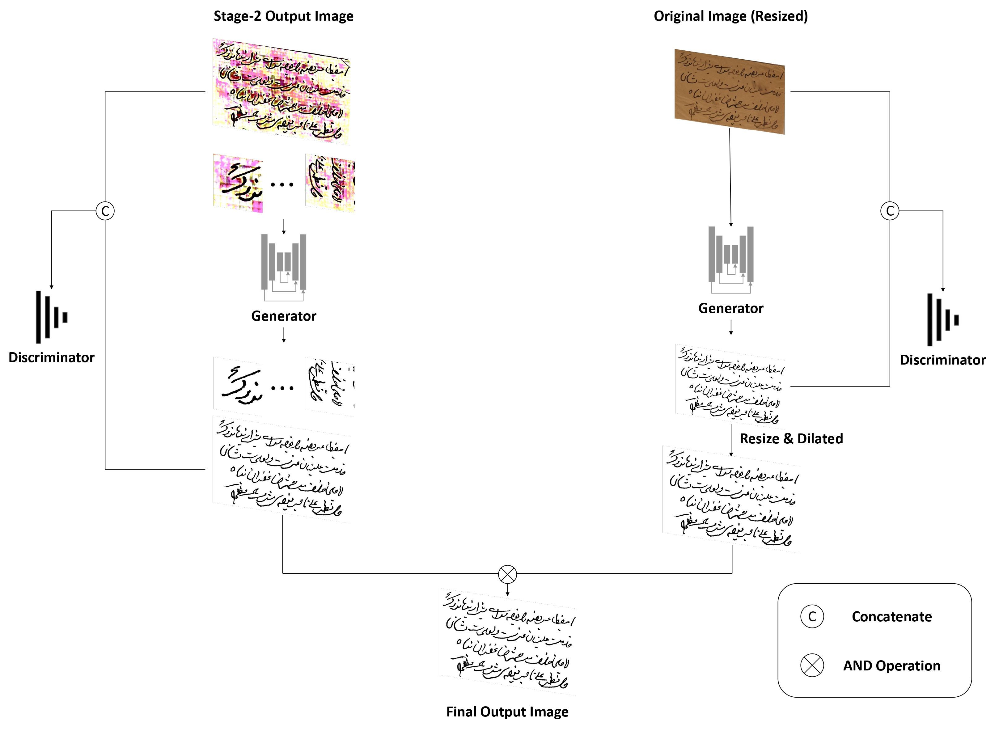

## [Three-stage binarization of color document images based on discrete wavelet transform and generative adversarial networks](https://arxiv.org/)
### Stage-1 Flowchart
<p align="center">
  
</p>

### Stage-2 Flowchart
<p align="center">
  
</p>

### Stage-3 Flowchart
<p align="center">
  
</p>

## Abstract
The efficient segmentation of foreground text information from the background in degraded color document images is a topic of concern. Due to the imperfect preservation of ancient documents over a long period of time, various types of degradation, including staining, yellowing, and ink seepage, have seriously affected the results of image binarization. In this paper, a three-stage method is proposed for image enhancement and binarization of degraded color document images by using discrete wavelet transform (DWT) and generative adversarial network (GAN). In Stage-1, we use DWT and retain the LL subband images to achieve the image enhancement. In Stage-2, the original input image is split into four (Red, Green, Blue and Gray) single-channel images, each of which trains the independent adversarial networks. The trained adversarial network models are used to extract the color foreground information from the images. In Stage-3, in order to combine global and local features, the output image from Stage-2 and the original input image are used to train the independent adversarial networks for document binarization. The experimental results demonstrate that our proposed method outperforms many classical and state-of-the-art (SOTA) methods on the Document Image Binarization Contest (DIBCO) dataset.

## Requirements
* Linux (Ubuntu)
* Python >= 3.6
* NVIDIA GPU + CUDA CuDNN

## Installation
* Install [segmentation_models](https://github.com/qubvel/segmentation_models.pytorch)
```
    pip install segmentation-models-pytorch
```
* Install [pytesseract](https://github.com/madmaze/pytesseract)
```
    pip install pytesseract
```
* Download [tesseract data](https://github.com/tesseract-ocr/tessdata_best)
```
    conda env create -f environment.yml
```

## Dataset
* Trainset: DIBCO 2009, H-DIBCO 2010, H-DIBCO 2012, PHIBD, SMADI, Bickley Diary Dataset
  Download [Link](https://www.dropbox.com/s/3qwv3jntmgu4rf9/Trainset.zip?dl=0)
* Testset: DIBCO 2011, DIBCO 2013, H-DIBCO 2014, H-DIBCO 2016, DIBCO 2017, H-DIBCO2018
  Download: [Link](https://www.dropbox.com/s/54ye0mtdcvqas4o/Testset.zip?dl=0)

## Usage
```bash
python3 main.py
```
optional arguments:

    --lr                default=1e-3    learning rate
    --epoch             default=200     number of epochs tp train for
    --trainBatchSize    default=100     training batch size
    --testBatchSize     default=100     test batch size

## Results
| Name | GPU Time (ms) | C10 Error (%) | FLOPs (G) | MAdd (G) | Memory (MB) | #Params (M) |
| :---: | :---: | :---: | :---: | :---: | :---: | :---: |
| **ThreshNet28** | 0.35 | 14.75 | 2.28 | 4.55 | 83.26 | 10.18 |
| SqueezeNet | 0.36 | 14.25 | 2.69 | 5.32 | 211.42 | 0.78 |
| MobileNet | 0.38 | 16.12 | 2.34 | 4.63 | 230.84 | 3.32 |
| **ThreshNet79** | 0.42 | 13.66  | 3.46 | 6.90 | 109.68  | 14.31 |
| HarDNet68 | 0.44 | 14.66 | 4.26 | 8.51 | 49.28 | 17.57 |
| MobileNetV2 | 0.46 | 14.06 | 2.42 | 4.75 | 384.78 | 2.37 |
| **ThreshNet95** | 0.46 | 13.31 | 4.07 | 8.12 | 132.34 | 16.19 | 
| HarDNet85 | 0.50 | 13.89 | 9.10 | 18.18 | 74.65 | 36.67 |

\* GPU Time is the inference time per image on NVIDIA RTX 3050

## Config
###### Optimizer 
__Adam Optimizer__
###### Learning Rate
__1e-3__ for [1,74] epochs <br>
__5e-4__ for [75,149] epochs <br>
__2.5e-4__ for [150,200) epochs <br>


### References
[DocumentBinarization](https://github.com/opensuh/DocumentBinarization)
